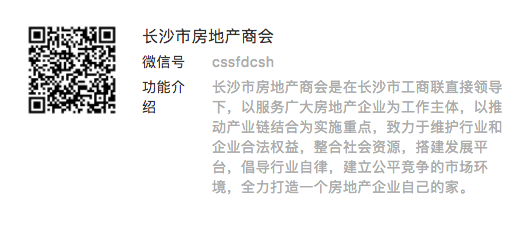

# 长沙买房攻略

对于一部分人来说，房子是不动产，是财产，或是一笔钱。但是，对于另一部分人来说，房子，是爱，是家，是归宿。
所以，买房有时候也像爱情一样，需要点缘分，也需要点毅力，希望各位在摇号选房的路上不要失望，不要盲目，适合你的也许就在前方。

## 遇见长沙
- [地理位置](./遇见长沙.md#地理位置)
- [行政区划](./遇见长沙.md#行政区划)
- [房产板块区划图](./遇见长沙.md#房产板块区划图)
- [限购区域](./遇见长沙.md#限购区域)
- [中心城区](./遇见长沙.md#中心城区)
- [副中心](./遇见长沙.md#副中心)
- [地铁交通规划与现状](./地铁交通规划与现状.md)

## 长沙楼市
- [库存供应](./遇见长沙.md#库存供应)
- [二手房价格地图](./遇见长沙.md#二手房价格地图)
- [关于进一步推进新建商品住宅全装修建设的通知](./全装修建设.md)
- [摇号政策](./摇号政策.md)

## 购房资格
- [购房资格认定程序]()
- [最新购房指导](./最新购房指导.md)
- [购房资格认定及可购买套数](./最新购房指导.md#购房资格认定及可购买套数)
- [差别化购房](./差别化购房.md)

## 落户购房
- [查看最新落户方法](./落户方法.md)

## 购房知识扫盲
- [用地性质](./知识扫盲.md#用地性质)
- [容积率](./知识扫盲.md#容积率)
- [买房时定金·订金·诚意金·认筹金区别](./知识扫盲.md#买房时定金订金诚意金认筹金区别)
- [绿化率多少合适·住宅小区绿化率标准](./知识扫盲.md#绿化率多少合适住宅小区绿化率标准)
- [楼层净高](./知识扫盲.md#楼层净高)
- [为什么每层住宅楼层默认高是在3米左右？](./知识扫盲.md#为什么每层住宅楼层默认高是在3米左右)
- [买房选择东边套·西边套·还是中间套？](./知识扫盲.md#买房选择东边套西边套还是中间套)
- [公摊面积](./知识扫盲.md#公摊面积)
- [房子如何买及首付要求](./知识扫盲.md#房子如何买及首付要求)
- [二手房购买攻略](./知识扫盲.md#二手房购买攻略)

## 关于开发商

## 房产媒体

