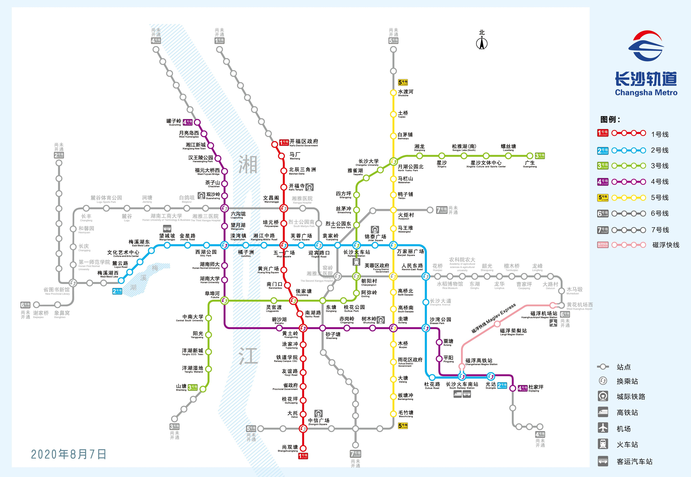
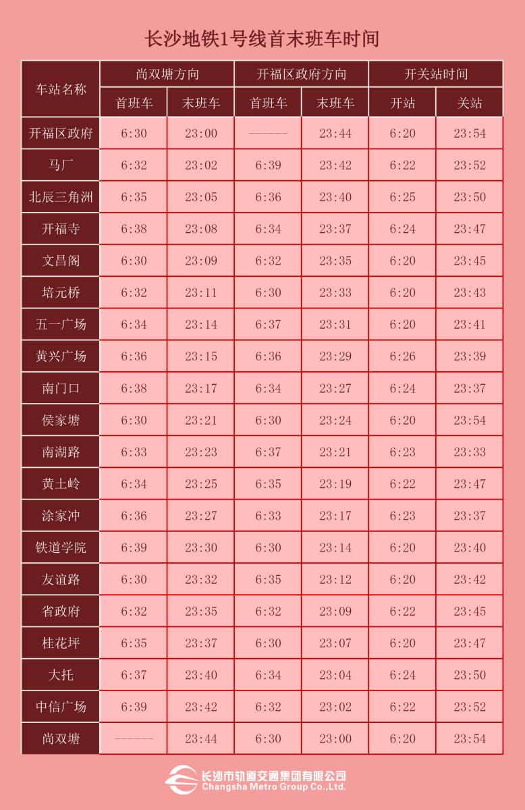
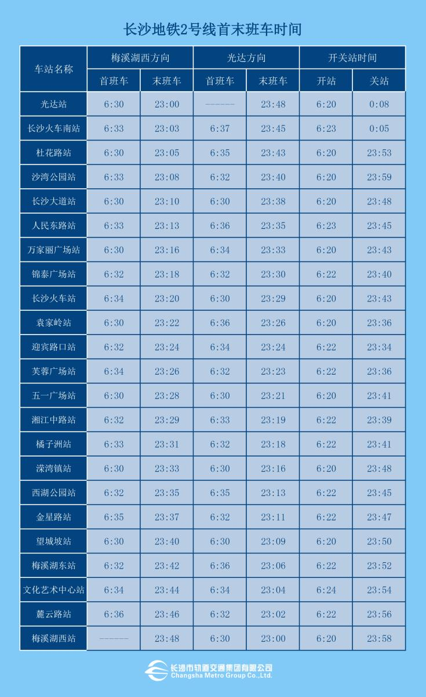
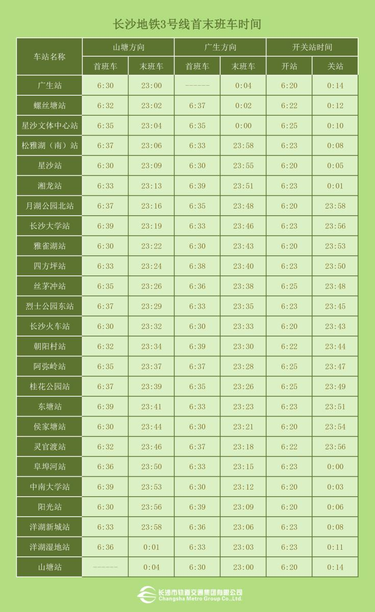
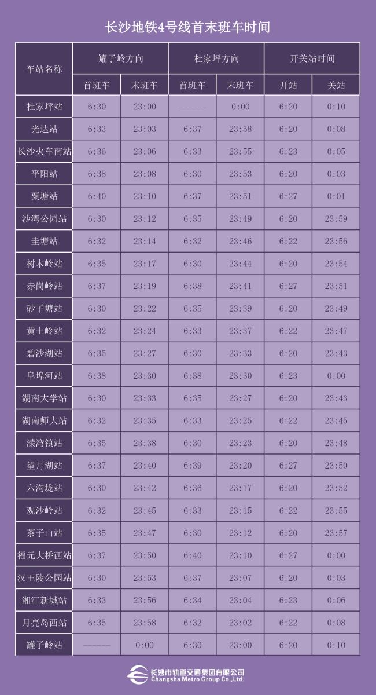
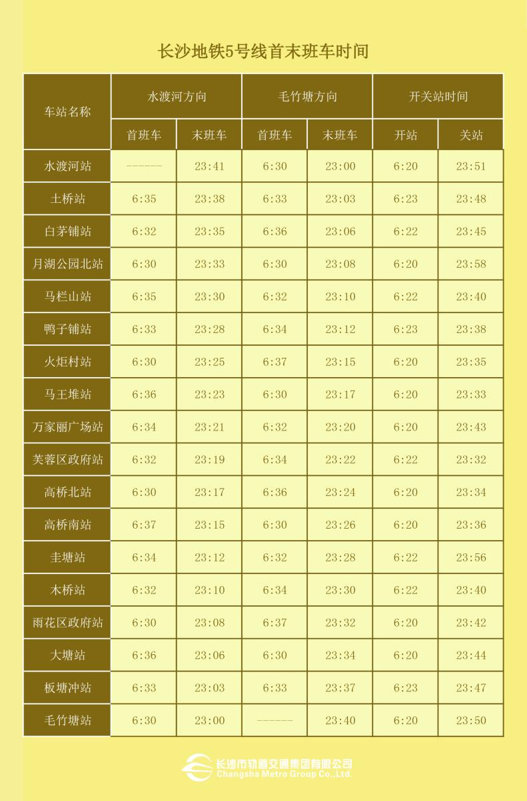
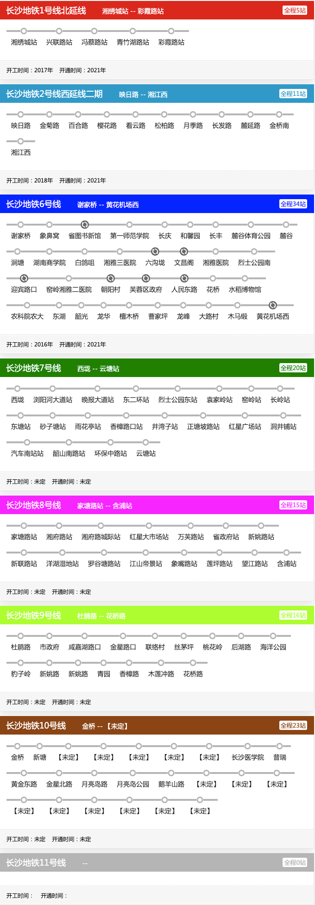

# 地铁交通规划与现状

## 目前的长沙轨道图（2020年）

## 目前的长沙地铁运营时间表（2020年）

## 规划图

## 最新进展

2020年11月23日，长沙地铁6号线白鸽咀站主体结构顺利封顶，是全线单体体量最大的车站之一。

2020年1月3日，长沙地铁3、5号线今日正式试运行 明年7月开通初期运营

2019年10月16日，长沙地铁3号线一期工程全线“洞通”

2018年5月30日，长沙地铁4号线望月湖站完成主体及附属结构全面封顶！这是长沙地铁4号线全线首个完成主体及附属结构全封顶的站点。

## 具体规划情况

|           线路          	|   起点   	|    终点    	| 开工时间 	| 通车时间 	|
|:-----------------------:	|:--------:	|:----------:	|:--------:	|:--------:	|
|   长沙地铁1号线北延线   	| 湘绣城站 	|  彩霞路站  	|  2017年  	|  2021年  	|
| 长沙地铁2号线西延线二期 	|  映日路  	|   湘江西   	|  2018年  	|  2021年  	|
|      长沙地铁6号线      	|  谢家桥  	| 黄花机场西 	|  2016年  	|  2021年  	|
|      长沙地铁7号线      	|   西垅   	|   云塘站   	|   未定   	|   未定   	|
|      长沙地铁8号线      	| 家塘路站 	|   含浦站   	|   未定   	|   未定   	|
|      长沙地铁9号线      	|  杜鹃路  	|   花桥路   	|   未定   	|   未定   	|
|      长沙地铁10号线     	|   金桥   	|  【未定】  	|   未定   	|   未定   	|
|      长沙地铁11号线     	|      	|    	|      	|      	|

## 具体线路

数据来源：

- http://cs.bendibao.com/
- http://www.hncsmtr.com/