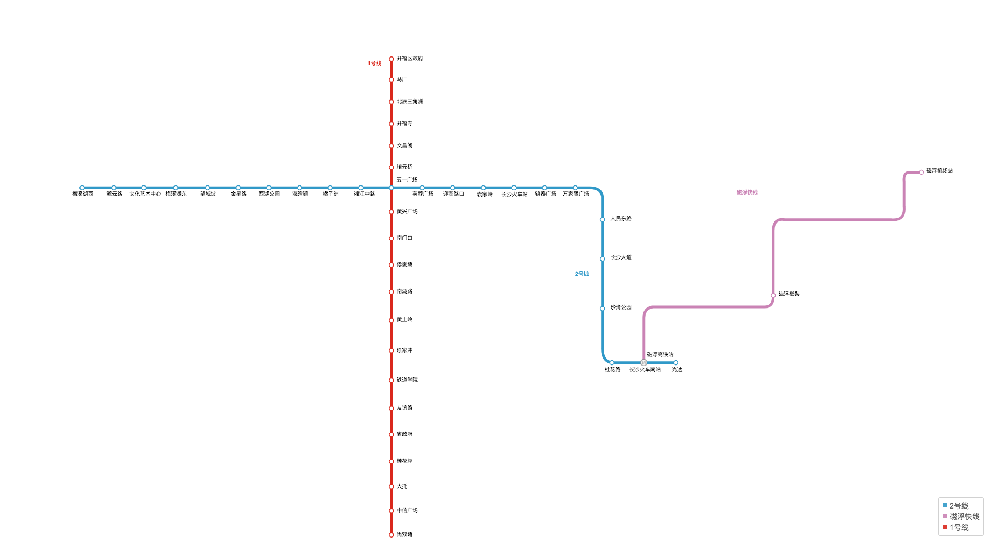
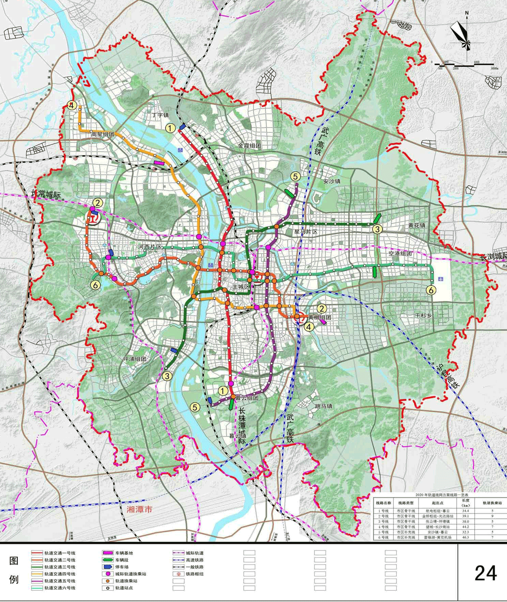
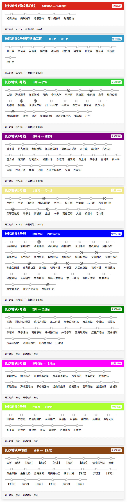

# 地铁交通规划与现状

## 目前的长沙地铁图（2018年）

## 规划图

## 具体规划情况

|线路|起点|终点|开工时间|通车时间|
|--- |--- |--- |--- |--- |
|长沙地铁1号线北沿线|湘绣城站|彩霞路站|2017年|2021年|
|长沙地铁2号线西延线二期|映日路|湘江西|2018年|2021年|
|长沙地铁3号线|山塘|广生|2014年|2019年|
|长沙地铁4号线|罐子岭|杜家坪|2014年|2018年|
|长沙地铁5号线|水渡河|毛竹塘|2015年|2020年|
|长沙地铁6号线|梧桐路站|西航站区站|2016年|2021年|
|长沙地铁7号线|西垅|云塘站|未定|未定|
|长沙地铁8号线|家塘路站|含浦站|未定|未定|
|长沙地铁9号线|杜鹃路|花桥路|未定|未定|
|长沙地铁10号线|金桥|【未定】|未定|未定|

## 具体线路

数据来源：http://cs.bendibao.com/