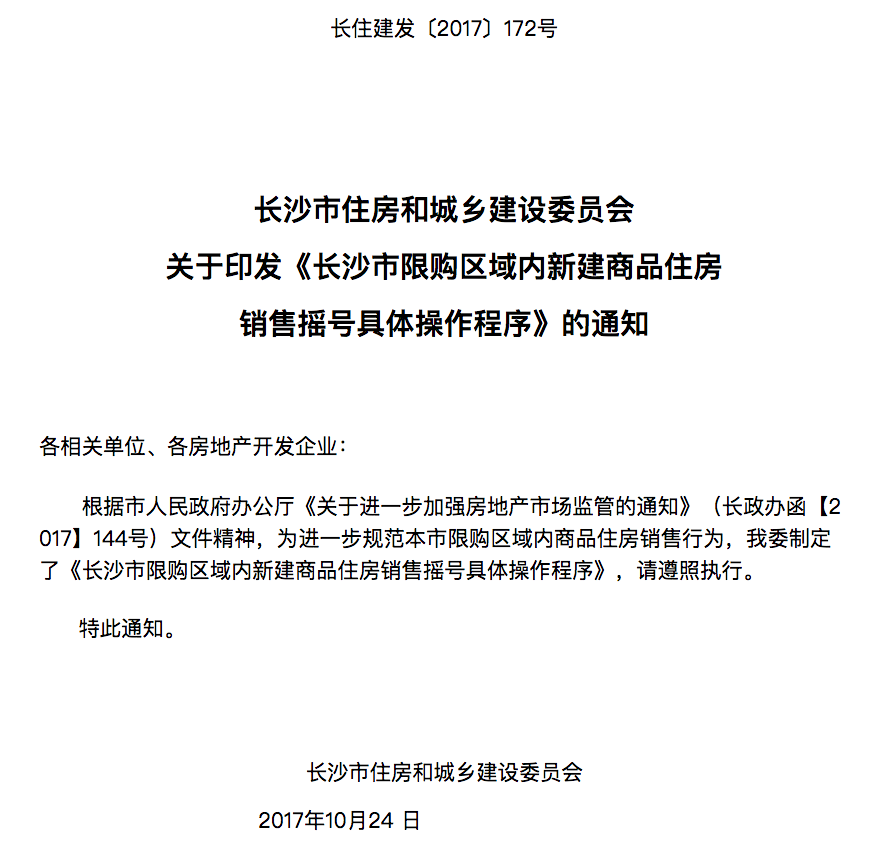
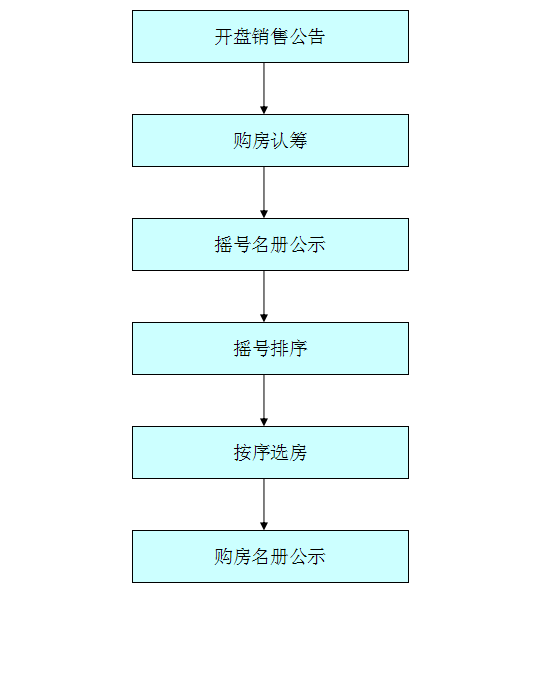

# 摇号政策

## 关于印发《长沙市限购区域内新建商品住房销售摇号具体操作程序》的通知

## 具体操作程序

一、明确摇号范围

本市限购区域范围内所有新建商品住房项目，凡累积购房客户大于可供房源的项目，应采取公开摇号方式销售商品住房。

二、申请摇号公证

开发企业提前7天向公证机构提出公开摇号公证申请，并提交公开摇号的具体规则和方案等材料。

三、发布摇号公告

开发企业在办理商品房预售许可后，应拿出公示后的准售房源进行摇号销售，于摇号3日前在销售现场（售楼部）发布摇号公告。

四、进行购房认筹

开发企业采取实名制方式公开接受意向购房人认筹，接受购房认筹时间不得少于3个工作日。开发企业应向购房人宣讲长沙市商品住房限购政策。认筹人应对自己提供资料的真实性负责，并承担因隐瞒不符合限购政策事项产生的后果。认筹完成后，留存认筹人身份证明复印件，编制《报名摇号名册》（附件1），报送公证机构备案确认（纸质和电子文档）。开发企业在（售楼部）醒目位置公示《报名摇号名册》，公示时间不少于72小时。

五、进行摇号排序

开发企业按照公证机构审核后的摇号方案、选房程序，进行商品房住房销售公开摇号。采用网络摇号方式销售商品住房的，公证机构、房屋交易管理中心应予以指导；采用现场摇号方式销售商品住房的，各区县（市）政府应派员参与现场秩序维护，公证机构和房屋交易管理中心应派员到现场指导。

摇号排序除生成与房源数量对应的名单外，还须生成房源数额30%的候补名单。

六、按序依次选房

摇号完成后，购房人依照排序名单依次选房，并当场签订认购书。选房结束后，编制《购房名册》（附件2）。该购房名册和对应的认购书报送市房屋交易管理中心。

部分因放弃选房或未通过购房资格审核而空出的房源，依照候补名单按序替补。

七、购房名册公示

《购房名册》须在市住建委网站和销售现场（售楼部）醒目位置予以公示。

八、此通知自公布之日起施行。

## 商品住房摇号具体操作流程图

