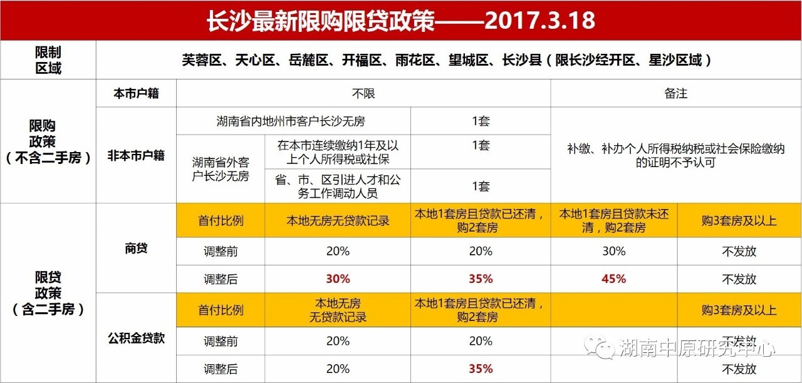
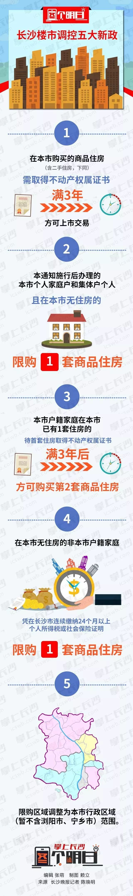

# 楼市新政

## 318新政

2017年3月18日，长沙市出台了近五年来首次的“限购限贷”调控政策。

规定非本市户籍家庭限购1套新房，购买首套商品住房首付比例不低于30%

长沙市限购区域为芙蓉区、天心区、岳麓区、开福区、雨花区、望城区、长沙县(限长沙经开区、星沙区域)。

以此确保长沙二手房交易市场平稳健康发展。

## 520新政

1. 暂停对在限购区域内已拥有2套及以上住房的本市户籍家庭出售商品房(含新建商品住房和二手房，下同);暂停对在限购区域内已拥有1套及以上住房的非本市户籍家庭出售商品住房。
2. 对在限购区域内无住房的非本市户籍家庭：凭在长沙市连续缴纳12个月以上个人所得税或社会保险证明限购1套商品住房;属于省、市、区引进人才和公务工作调动的非本市户籍家庭凭有关部门证明限购1套商品住房。
3. 在限购区域内购买的商品住房，需取得《不动产权证书》满2年后方可上市交易。

## 923新政

2017年9月23日，长沙市住建委发布《关于进一步稳定房地产市场促进健康发展的通知》(以下简称“通知”)。在此次调控中，长沙市首度提出 “首套房取得产权证满3年后才能购买第二套房”。 

1. 在本市购买的商品住房（含二手住房，下同），需取得不动产权属证书满3年方可上市交易。
2. 本通知施行后办理的本市个人家庭户和集体户个人，且在本市无住房的，限购1套商品住房。
3. 本市户籍家庭在本市已有1套住房的，待首套住房取得不动产权属证书满3年后，方可购买第2套商品住房。
4. 在本市无住房的非本市户籍家庭，凭在长沙市连续缴纳24个月以上个人所得税或社会保险证明限购1套商品住房。
5. 限购区域调整为本市行政区域（暂不含浏阳市、宁乡市）范围。

