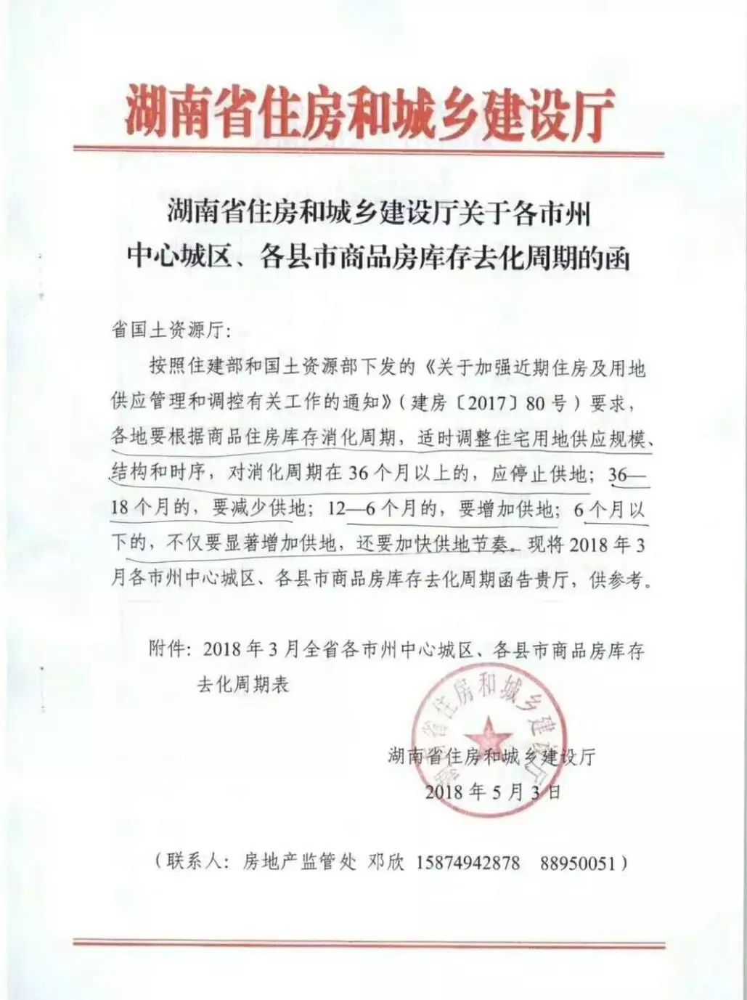

# 长沙楼市

## 库存供应

- 长沙住宅库存严重不足

    根据5月3日由湖南省住建厅在致省国土资源厅发出的公函中明确称，在累计已办理预售许可或现房销售备案但尚未销售面积的住宅去化周期方面，长沙市中心城区为2.8个月，长沙县为2个月，浏阳市为1.9个月，宁乡市为4.7个月。
    
    不愿具名的长沙业内人士直言，长沙去化周期缩短至3个月的临界点以下，若不及时果断采取有效措施，必将带来市场面的快速变化。2016年上半年合肥房价之所以暴涨，就在于该市新建商品住宅可售面积去化周期一度降至1.4个月，市内部分区域几乎无房可卖。
    
    公函称，按照住建部和国土资源部(现为自然资源部)下发的《关于加强近期住房及用地供应管理和调控有关工作的通知》(编者注：去年4月联合下发)要求，各地要根据商品住房库存消化周期，适时调整住宅用地供应规模、结构和时序，对消化周期在36个月以上的，应停止供地;36个月至18个月的，要减少供地;12个月至6个月的，要增加供地;6个月以下的，不仅要显著增加供地，还要加快供地节奏。
    
    长沙被通报住宅去化周期在3个月以下，已不是第一次。去年8月份末，住建部房地产市场交易信息日报系统监测也曾通报，当时长沙市新建商品住宅可售面积去化周期仅为2.8个月，可售面积已严重不足。

- 住宅供地有效供应偏少
    
    有长沙业内人士认为，累计已办理预售许可证但尚未销售的住宅面积去化周期不能说明问题，还应统计已经开工但未办理预售许可证的住宅面积。另一部分业内人士则认为，开工了不领预售证，并没有形成有效供应，这和闲置土地不盘活又有多少异同?
    
    公开数据显示，长沙市区(内五区)住宅用地供应连年下滑，2014年、2015年分别是579公顷、356公顷。2016年土地供应量虽略有恢复，2017年又同比下降。从长沙市土地市场近5年的交易情况来看，2015年长沙市明显放缓了推地节奏，土地供应尤其是住宅用地的供应量偏少。2016年、2017年土地市场虽然同比有所升温，但土地出让面积仍远少于2013年。
    
    据媒体统计，2017年长沙市内六区挂牌108宗土地，其中成交102宗，中止4宗，未成交2宗。从土地性质来看，挂牌的108宗土地中，工业用地45宗，商业、住宅用地19宗，商业用地17宗，其他用地14宗，住宅用地仅13宗，工业用地占据了4成以上的份额。
    
    按照湖南省国土资源厅2017年5月23日对长沙市2017年度国有建设用地供应计划备案的批复，2017年长沙市内六区国有建设用地供应计划为2516.43公顷(合37746.45亩或2516.43万平方米)，含新增国有建设用地1765.35公顷(合26480.25亩或1765.35万平方米)。其中，长沙市内六区住宅用地供应计划为396.2公顷(合5943亩或396.2万平方米)，含新增住宅用地供应186.75公顷(合2801.25亩或186.75万平方米)。
    
    也就是说，2017年长沙市内六区实际出让土地面积，仅完成供应计划的四分之一左右。
    
    “从产业发展的需要，增加非住宅用地供应无可厚非，但要稳定楼市预期，长沙还是应果断增加住宅用地的有效供应。”一位长沙业内人士称，增加非住宅用地供应，确实短期内保障了土地财政收入，但人口持续流入长沙所带来的大量的住房刚性需求和改善性需求，已不容忽视，过分依靠以处置缓慢的闲置土地转化为有效的住宅用地供应，难以符合调控的实际情况。

## 二手房价格地图

[最新二手房价格地图]()