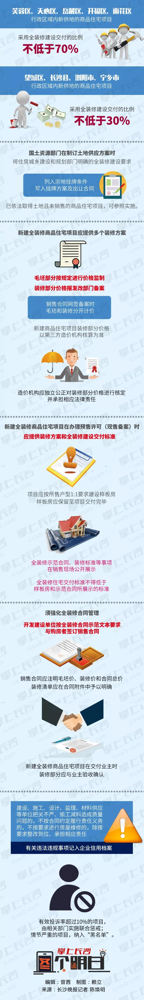
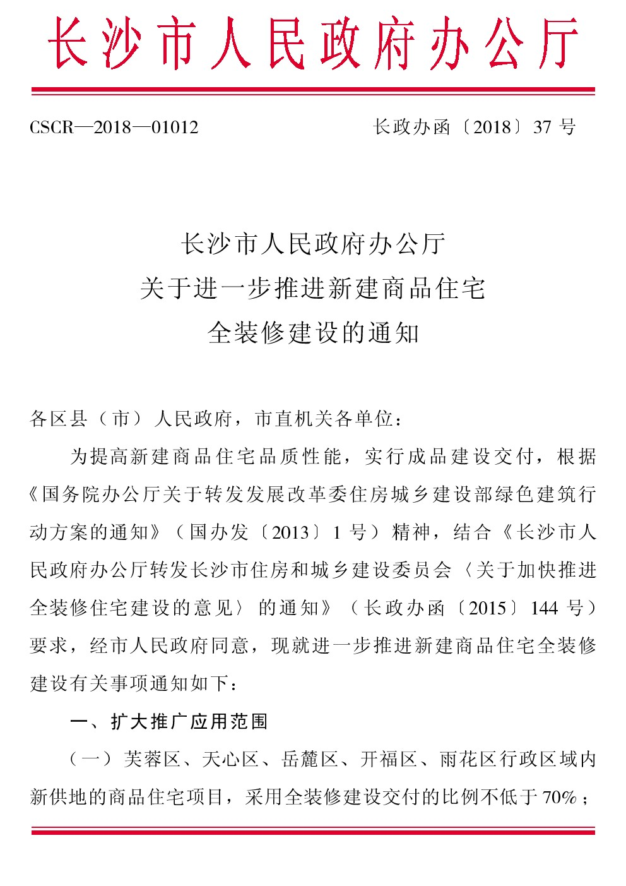
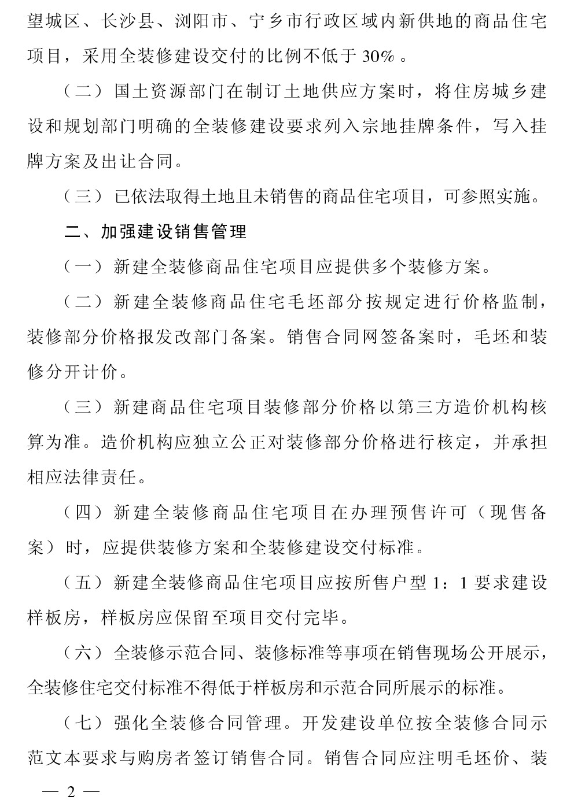
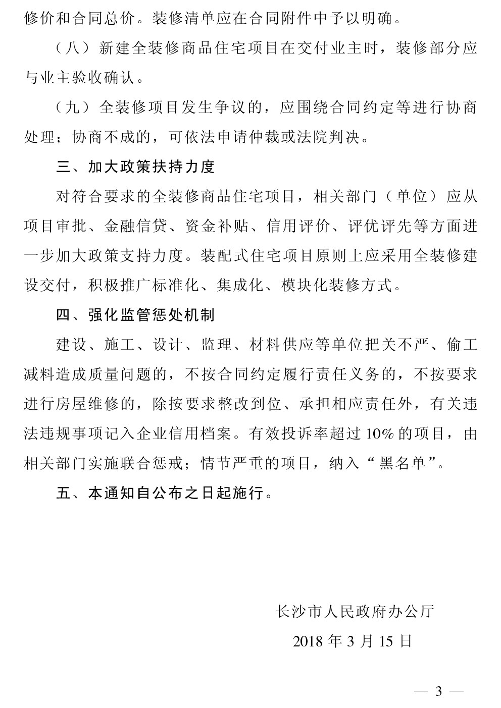

# 关于进一步推进新建商品住宅全装修建设的通知

芙蓉区、天心区、岳麓区、开福区、雨花区行政区域内新供地的商品住宅项目，采用全装修建设交付的比例不低于70%。望城区、长沙县、浏阳市、宁乡市行政区域内新供地的商品住宅项目，采用全装修建设交付的比例不低于30%。

## 详细说明

## 政府文件

[下载此文件PDF](http://www.changsha.gov.cn/xxgk/szfxxgkml/zfwj2016/bgtwj2016/201803/P020180323347832087783.pdf)