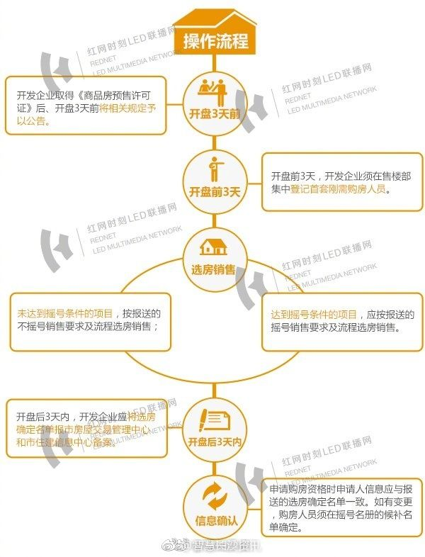

# 差别化购房（刚需/非刚需）

2018年3月27日，长沙发布通知：对长沙限购区域内商品住房销售实行差别化调控措施。
相当于给长沙首套刚需购房群体开通了一个购房绿色通道。
在5月23日，长沙住建委又发布了这项政策的操作细则。看看你是否满足“首套刚需”？“首套刚需”购房怎么买？

### 怎样才能算属于首套刚需购房群体?
首套购房刚需群体为长沙市户籍的无房家庭和个人(文件施行后离婚且不满1年的不包括在内)、自签订征收协议之日起1年内的被征收人以及符合长沙市限购政策的本市以外户籍无房家庭。

说明：
1. “无房”是指家庭成员及本人在本市限购区域范围内无住房信息记录或者文件施行后住房信息记录注销时间在1年以上的家庭和个人。(长沙限购区域：芙蓉区、开福区、雨花区、天心区、岳麓区、望城区、长沙县)
2. 长沙市户籍的无房家庭和市外户籍的无房家庭其成员是指夫妻双方(离异或丧偶的夫或妻)及未成年子女。
3. “文件施行后离婚且不满1年”，是指2018年3月27日后办理离婚登记的长沙市户籍无房个人自离婚登记之日起不满1年。
4. “文件施行后住房信息记录注销时间在1年以上”，是指2018年3月27日后住房信息记录注销时间在1年以上。
5. 根据“人才新政”规定入选高精尖人才和获得“长沙人才绿卡”的A、B、C、D类高层次人才，以及符合长沙市限购政策的现役军人，属于首套刚需购房群体。

快速参考：

| 非刚需资格  | 刚需资格 |
| ------------ | ------------ |
| 1. 长沙户籍，离异分户，个人在长限购区域内无房，离婚未满一年 2. 长沙户籍，离异未分户，但名下抚养未成年子女，个人在长限购区域无房，离婚未满一年 3. 非长沙户籍，成年未婚，能提供最近30个月内24个月连续社保或个税，个人在长限购区域无房 4. 有房票，但在327之后注销房产或离婚未满一年的 |  1. 长沙市户籍(不包括学校集体户)，家庭成员在长限购区无房，拥有一张“刚需”房票 2. 非长沙户籍且已婚，能提供在长最近30个月内连续24个月社保或个税证明，拥有一张“刚需”房票 |

### 申请流程是怎样的?

房地产开发企业在进行刚需房源销售时，应按照申报方案、公示方案、集中登记、制订申请名册、选房销售、报备确定名单等六大步骤进行。

说明：

1. 申报方案。开发企业在申报商品房预售许可证前，应将项目开盘方案报市房屋交易管理中心备案并接受指导。
2. 公示方案。取得商品房预售许可证后、开盘3日前，在售楼部等显著位置公示项目开盘方案及其相关销售材料。
3. 集中登记。符合首套刚需购房群体条件的购房申请人，应在公示的登记时间内到开发企业售楼部提出购房申请，并提交符合首套刚需购房的相关资料。
4. 制订申请名册。开发企业根据申请顺次对申请人提交的资料进行核查，符合首套刚需购房条件的，在《期现房销售及预售资金监管系统》录入申请人及其家庭成员信息，按业务系统通过的先后顺序制订申请名册，并于项目开盘前将申请名册报交易中心备案。非首套刚需购房的申请人另行造册。
5. 选房销售。项目选房前，开发企业应当将备案的申请名册在售楼部等显著位置进行公示。首套刚需购房申请人数未达到摇号条件的，开发企业应在开盘后3日内按照申请名册的先后顺次选房销售，同时将购房资格信息录入业务系统，制定选房确定名单;首套刚需购房申请人数达到摇号条件的，按照报送的公证摇号销售流程选房销售(原则上应按摇号结果的先后顺次进行)，同时将购房资格信息录入业务系统，制定选房确定名单。
6. 报备确定名单。项目开盘后3日内，开发企业应将选房确定名单(包括纸介质和电子介质)报市房屋交易管理中心和市住建信息中心备案;摇号销售的，还应包括候补名单。交易中心相应网点具体负责购房资格审核和合同备案等工作，并按照选房确定名单在3日内审核购房资格。未通过购房资格审核的，开发企业应及时到交易中心注销原购房人信息;摇号销售的，新购房人应从候补名单中依次产生，开发企业应在3日内申请购房资格审核;不是摇号销售的，按销售方案中的剩余房源处理。

### 购房需要提交资料
1. 《长沙市首套刚需购房申请表》。
2. 本人及家庭成员户籍材料和身份证明。
3. 家庭成员关系证明。
4. 市外户籍家庭还需提供符合限购政策的社保或个税等证明材料。
5. 其他材料。

说明：
1. 需提醒购房者注意的是，所提交的资料应当携带原件和复印件，并保证资料的真实性、合法性和有效性，承担隐瞒不符合首套刚需购房事实的后果。
2. 对提供虚假资料骗取首套刚需购房资格的购房申请人，将列入购房资格不诚信名单。

### 如果选了房又不想要了，怎么办?
1. 选房确定名单中的购房人因故退房的，应到交易中心办理撤销首套刚需购房手续并提交相应资料;无故退房的，该购房人及其家庭成员在半年内不能享受首套刚需购房优先的待遇。