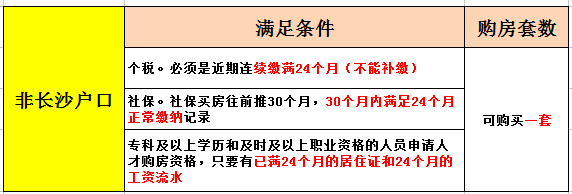
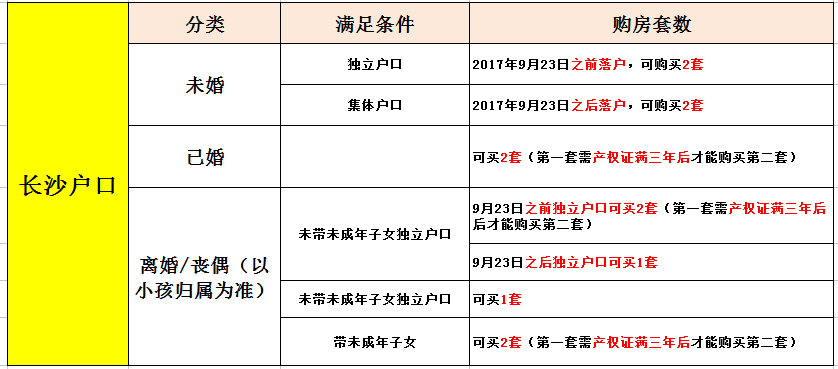
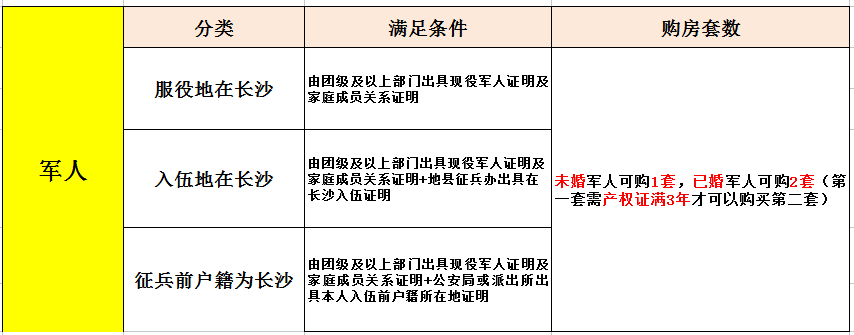

# 2018最新购房指导

长沙市在2017年3月份实施了新的住房限购政策，到5月20日的时候长沙房地产的调控进一步升级，所以现在长沙的购房限购政策可以让很多人非常的烦恼。到底在长沙买房具体是怎样的呢，而在长沙买房，首付又需要多少呢？让我们一起来看看这篇文章吧。

## 限购区域

芙蓉区、天心区、岳麓区、开福区、雨花区、望城区、长沙县。

## 户籍认定

### 普通居民
1. 户籍，以公安部门的户籍证明（含集体户口）为准，不以身份证号为准。
2. 户籍家庭，家庭成员（配偶及未成年子女，下同）中有长沙市户籍的，属于本市户籍家庭；家庭成员中无长沙市户籍的，属于本市外户籍家庭。
3. 个人家庭，指居民户口簿上户主与常住人口为同一人。

### 现役军人
1. 现役军人，包括现役军官、武警警官、士官、义务兵。
2. 现役军人服役地、入伍前户籍地、入伍地在长沙的，提交下列证明的，参照本市户籍家庭政策执行。
3. 服役地在长沙市的，由所在团级以上干部（士兵）管理部门出具现役军人身份证明（含军官证、警官证、士官证、士兵证及身份证）及家庭成员关系证明。
4. 入伍前户籍地在长沙市的，除上款证明外，还需由入伍地公安部门（含派出所）出具本人入伍前户籍所在地证明；入伍地在长沙市的，除上款证明外，还需由入伍地县（市）级征兵办出具从长沙入伍的证明。

## 拥有住房套数的规定 

### 住房属性
以长沙市商品房销售网上签约系统和长沙市不动产登记系统认定的房屋性质为准。

### 住房套数
是指本人及家庭成员在限购区域内已合同网签和已办理房屋所有权证、不动产证的住房套数；已注销的住房和非住宅，不计入住房套数。

### 关于被征收人的购房套数问题
在限购区域内，被征收人原房屋被征收，可以在签订征收协议后一年内，凭长沙市征收办已备案的拆迁协议向长沙市房屋交易管理中心申请按被征收套数购买商品住房。

### 关于限购商品住房套数的认定
2017年9月23以后（含9月23日）办理的本市个人家庭和集体户个人，且在限购区域内无住房的，限购1套商品住房。本市户籍家庭，待首套住房取得不动产权属证书满3年后，方可购买第2套商品住房。

### 特殊房产交易限制
因法院判决、继承取得不动产（房屋）权属的，不受限购政策限制，也不受满三年上市交易限制；
经济适用房及棚改货补房上市、遗失补证、变更、更正、离异及夫妻约定取得不动产（房屋）权属证书的，按换证前不动产（房屋）权属证书登记时间起算，满三年方可上市交易。

### 其他情况
赠与、拍卖（不含法院拍卖）按限购政策执行。

## 限购政策

### 限购商品房住房套数问题
1. 2017年9月23日后（含2017年9月23日）办理的本市个人家庭户和集体户个人，且在限购区域内无住房的，限购1套商品住房。
2. 本市户籍家庭，待首套住房取得不动产权属证书满3年后，方可购买第2套商品住房。
3. 在本市购买的商品住房（含二手住房），需取得不动产权属证书满3年方可上市交易

### 非本市户籍
在本市无住房的非本市户籍家庭，凭在长沙市连续缴纳24个月以上个人所得税或社会保险证明限购1套商品住房。

### 毕业生买房资格
- 在长沙就业的大中专毕业生，无年龄限制（落户后购买）。提交资料：准备好以下资料后，去单位所在地的公安派出所办理落户（集体户口），一般10天左右落户成功。
    1. 户口页、身份证(原件和复印件)
    2. 毕业证原件及复印件(需本人注册学信网)
    3. 就业报到证(两年内)或合法稳定就业免证(劳务或用工合同)
    4. 缴纳社保的凭证。登陆长沙市12333公共服务平台，网址: https://www.cs.12333.com 输入证明首页右上角的在线验证码进行验证，并打印出来，注:需彩色打印(详单)
    5. 用工单位的营业执照复印件加盖单位公章，且单位注册地址必须与劳动合同地址致。
    6. 迁入人员提供彩色寸照2张，外省迁入的加带户口页的首页。

- 35岁以下全日制本科及以上学历（落户后购买）。提交资料：准备好以下资料，前往长沙市政务服务中心一楼A45-48窗口【咨询电话：（0731）88666740、88666741】、或迁入地公安派出所办理集体户口。
    1. 户口页原件及复印件
    2. 毕业证原件及复印件
    3. 教育部学历证书电子注册备案表或教育部学历在线验证报告(网址，http://www.chsi.com.cn)
    4. 申请表(一) 
    5. 非本人办理的，准备委托书份（委托直系亲属）

## 个人所得税证明 

已通过扣缴义务人明细申报个税的纳税人和已完成申报的个人独资企业、合伙企业的自然人投资者，可持二代身份证到地税部门设置的自助终端上打印个税完税证明；
未实现明细申报的纳税人，应由纳税人提供合法身份证明、已扣缴税款凭证和扣缴义务人情况说明，经地税机关办税服务厅工作人员核实后，方可获得相应期间实际缴纳个税的完税证明。
凡2017年（8月8日）之后完税凭证上提示补缴的，一律不得通过购房资格审核和办理备案。

## 限购操作流程
1. 拟购房人在开发商处填写《长沙市购房资格确认申请表》，收取相关证明材料，开发商审核后在网签系统中录入拟购房人相关信息，并上传到市房屋交易管理中心；
2. 市房屋交易管理中心每天定时将当天申请信息提交到公安、社保等部门予以核实；相关部门在2个工作日内将核实情况反馈到市房屋交易管理中心；现役军人的，开发商需提交收取的相关证明资料，由市房屋交易管理中心统一报长沙市警备区审核；
3. 市房屋交易管理中心汇总各部门审核信息，一个工作日内确认购房资格；
4. 符合购房资格的，开发商打印《长沙市购房资格确认书》，签订网签合同；不符合购房条件的，开发商取消网签业务，退还收取的资料并告知购房人及原因；
5. 办理合同备案时，开发商须提交《长沙市购房资格确认书》；期、现房经网签备案后才能办理登记、转让、抵押、租赁、贷款、完税等手续。

## 望城区和长沙县购房资格确认
由区、县统一提交相关信息，报市房屋交易管理中心汇总，按程序进行审核。

## 购房资格认定及可购买套数

### 非长沙户籍

### 长沙市户籍

### 军人

## 买房首付

