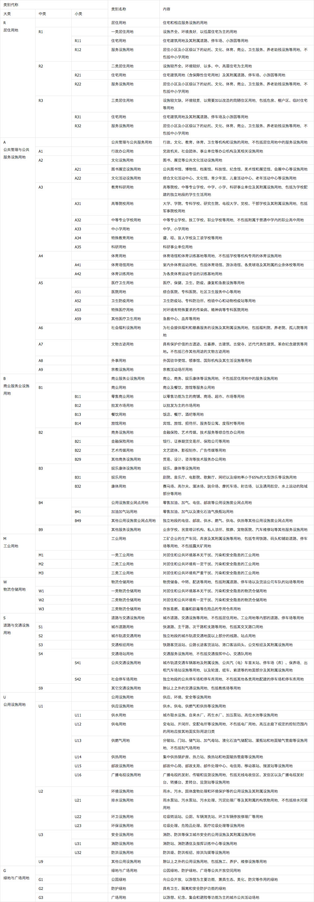
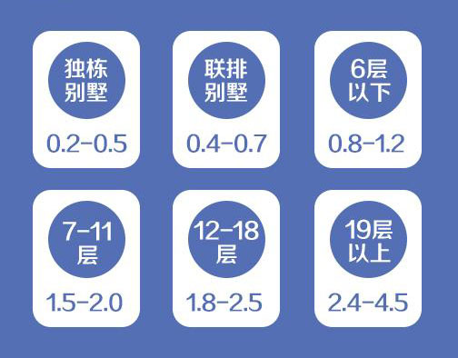
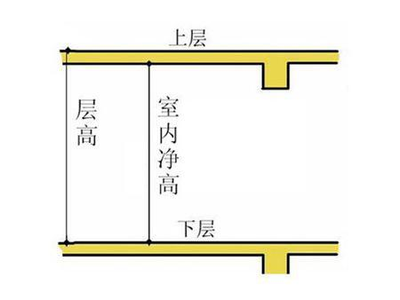
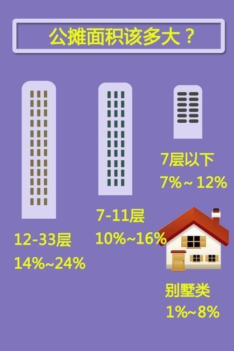
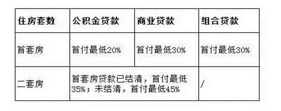

# 楼市扫盲

## 用地性质

## 容积率

### 不同类型楼盘合理的容积率范围

### 楼盘容积率多少合适
1. 通常来讲，一个良好的居住小区，高层住宅容积率应不超过5，多层住宅应不超过2，绿地率应不低于30％。一般情况下，独栋别墅楼盘的容积率在0.5～0.8之间，多层、洋房楼盘的容积率在1～1.5之间，小高层楼盘的容积率在2.5左右，高层楼盘容积率大多数在4以上。

2. 0.3～0.5，一般独栋别墅项目，环境还可以，但感觉有点密了。如果穿插部分双拼别墅、联排别墅，就可以解决这个问题了。

3. 0.5～0.8，一般的双拼、联排别墅，如果组合3～4层，局部5层的楼中楼，这个项目的品位就相当高了。

4. 0.8～1.2，全部是多层的话，那么环境可以堪称一流。如果其中夹杂低层甚至联排别墅，那么环境相比而言只能算是一般了。

5. 1.2～1.5，正常的多层项目，环境一般。如果是多层与小高层的组合，环境会是一大卖点。

6. 1.5～2.0，正常的多层＋小高层项目。容积率2.0～2.5，正常的小高层项目。容积率2.5～3.0，小高层＋二类高层项目（18层以内）。此时如果做全小高层，环境会很差。

7. 容积率3.0～6.0，高层项目（楼高100米以内）。容积率6.0以上，摩天大楼。

### 楼盘容积率大好还是小好
1. 容积率很高的住宅项目意味着小区内房子建得密杂，而这类的住宅必定会带来高密度的居住人口，导致小区内居住者的生活舒适度下降。

2. 高密度的居住人口还会对小区内的健身场所、儿童活动区域、会所核心以及楼宇内的电梯、消防通道形成比较大的压力。频繁地使用会加速这些设施的老化率，所以在购买高密度小区时应该对此保留一定的要求。

3. 容积率较小，则房价较高；容积率较大，则房价较低。对于一个楼盘的容积率大好还是小好，业界普遍认为，容积率越高的小区，居住舒适度越低。

需要注意的是，住宅容积率一般在土地拍卖时就已确定，只有什么产品适合什么容积率的问题了。

## 买房时定金·订金·诚意金·认筹金区别
|分类|定义|是否可以无条件退款|
|--- |--- |--- |
|定金|定金是在合同订立或在履行之前支付的一定数额的金钱作为担保的担保方式，又称保证金《担保法》第八十九条当事人可以约定一方向对方给付定金作为债权的担保。债务人履行债务后，定金应当抵作价款或者收回。给付定金的一方不履行约定的债务的，无权要求返还定金;收受定金的一方不履行约定的债务的，应当双倍返还定金。|无权要求返还定金|
|订金|在购房者与发展商就房屋买卖的意向初步达成协议后，准备进一步协商签订的临时认购协议，通常的做法是在约定所选房号、面积、房屋单价及总价款后，约定一个期限，买方需在此期限内与卖方签署正式合同。买方支付订金即取得了在此期限内的优先购买权。一般情况下，视作预付款。预付款不具有担保债的履行的作用，也不能证明合同的成立。预付款在合同正常履行的情况下,成为价款的一部分,在合同没有得到履行的情况下,不管是给付一方当事人违约,还是接受方违约,预付款都要原数返回。|无条件退款|
|认筹金|“认筹”就是购房者表现出买房的诚意，这个诚意需要通过缴纳“认筹金”来体现。在缴纳“认筹金”后，购房者可以获得房屋的优先购买权，并在房价上享受一定程度的优惠。等到楼盘正式开盘销售时，“认筹”的购房者再以“优先选择”的顺序选房，选中房屋后与开发商签订正式的房屋买卖合同。如果购房者没有选中理想的房屋，开发商将把“认筹金”如数退还给购房者。但是“认筹金”的实质作用是开发商在开盘前得到的大笔资金并在短时期内收回大笔资金，解决开发商的燃眉之急。|无条件退款|
|诚意金|即意向金，这在中介与买房和卖房双方签定的合同中多有体现，其实法律上并没有诚意金之说，中介与买卖双方之所以签定什么诚意金条款，主要是由于我们交易市场的诚实信用体系还不健全，交易主体为了各自的利益往往会违背诚实信用的原则，从而损害一方的利益。|无条件退款|

## 绿化率多少合适·住宅小区绿化率标准

## 楼层净高

## 为什么每层住宅楼层默认高是在3米左右？

一般认为，房屋层高越高，室内高低处温度的温差越大，空气对流越好，人体感觉越舒适，但房屋的保温性、节能性相对较差。根据住建部、国家质量监督检验检疫总局联合发布的《住宅设计规范》（GB50096-2011）规定，住宅层高宜为2.80米。要明确的是，之所以把住宅层高控制在2.80米以下，目的不仅是控制投资的问题，重要的一点是为住宅节地、节能、节材、节约资源。

1. 卧室、起居室（厅）的室内净高不应低于2.40米，局部净高不应低于2.10米，且其面积不应大于室内使用面积的1/3。

2. 利用坡屋顶内空间作卧室、起居室(厅)时，其1/2面积的室内净高不应低于2.10米。

3. 厨房、卫生间的室内净高不应低于2.20米。

4. 厨房、卫生间内排水横管下表面与楼面、地面净距不得低于1.90米，且不得影响门、窗扇开启。

## 买房选择东边套·西边套·还是中间套？
边套：边套是指有一面墙完全承受日晒的套房，其中在东边的称东边套，西边的西边套。西套因为承受下午日晒，俗话说西晒，居室内相对较热。

中间套：中间套是2个边套（东边套、西边套）中间的房子，一般客厅、餐厅、阳台连为一体，阳台较大、视野较为开阔。

||优点|缺点|选择意见|
|--- |--- |--- |--- |
|东边套|1、三面采光，窗明几净，阳光充足； 2、早晨可以被第一缕阳光照醒； 3、夏季东南风为主，通风好，凉快，不存在西晒。|1、客厅阳光照射时间短，冬天比较阴冷； 2、在南方的话，受雨季和风向的影响，东边套的房子，下雨天更容易进水；而且更为潮湿。|注意看房屋的防潮防水措施是否妥当，避免出现漏水，也略微减轻室内的潮湿程度。东边套和西边套来比较，东边套的采光和通风性往往更好，这也是人们选择户型时比较看重的，而且夏天不会有西晒问题，室内较西边套更为凉爽，如果你比较怕热，而且喜欢早上的第一缕阳光，那你最好选择东边套。|
|西边套|1、下午阳光充足，下班到家还能享受到较后一缕阳光； 2、渗水的可能性比较小； 3、冬天比较温暖，省了暖气钱； 4、比东边套价格便宜。|1、夏天西晒就很严重，会很热； 2、冬天西边套的阳台晒太阳的时间也有限，可能不够温暖，西北风劲头也很足。|注意看西边有无遮挡，房屋的保温设施做得如何，能在一定程度上能减轻西晒的影响。西边套的最大问题是西晒，夏天会比较热，如果在北方，冬天的时候因为风向的问题也往往比东边套更冷，但与东边套相比，西边套在多雨水季节发生渗水的可能性更小。如果你想在冬天的时候能够多晒晒太阳，而且不是特别怕热，认为在夏天的时候一个空调可以解决西晒问题，那么西边套也不失为一个好选择。最重要的是，西边套的价格往往比东边套更便宜。|
|中间套|1、有一些三面朝南的套二户型，采光非常好； 2、客厅朝南，下午不会没阳光，也不存在西晒。 3、价格上来说，单价比边套便宜。|1、由于位于中间，只有南北两面采光，容易出现暗间； 2、通风性稍逊东边套和西边套。 3、中间的房子可能听到隔壁邻居传来的声音。|注意选择南北通透的户型。|

## 公摊面积

公摊面积的计算方法：

1. 房子分摊的公用建筑面积＝房子公用建筑面积分摊系数×套内建筑面积。公用建筑面积分摊系数＝公用建筑面积／房子套内建筑面积之和。
2. 公用建筑面积＝整栋房子建筑物的建筑面积－整栋建筑物各套（单元）套内房子建筑面积之和－已作为独立使用的空间销售或者用来出租的地下室、车棚及人防工程等建筑面积。套内建筑面积＝套内使用面积＋套内墙体面积＋阳台建筑面积。

## 房子如何买及首付要求
先确定自己是否有购房资格。

首付贷款比例

## 二手房购买攻略

