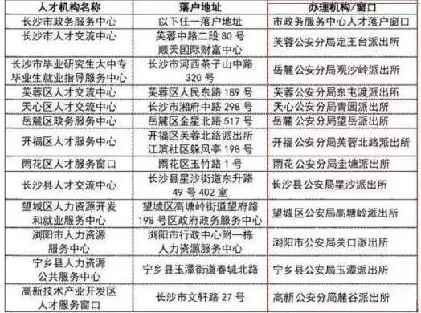

# 最新长沙落户方法

## 本科毕业生落户

### 落户政策：

35周岁以下（含）具有全日制本科及以上学历的应（往）届高等院校毕业生（以下简称“高校毕业生”），迁入长沙市行政区域内城镇地区落户的。

### 落户条件：

1、35周岁以下（含）；

2、全日制本科及以上学历的应往届高等院校毕业生；

3、落户区域：长沙市行政区域内城镇地区。

提醒：

1、根据身份证上的年龄计算，36周岁以下都可以。

2、必须是全日制本科，就是其他函授、自考的学历形式是不可以的。

3、如果年龄或者学历没有达到要求，建议以“大专生就业落户”进行落户办理。

4、跟社保、工作无关，就是说不管你有没有工作有没有社保，都可以办理。

### 落户材料：

1、迁入户口申请表

2、毕业证书（原件复印件）

3、身份证、户口页（原件复印件）

4、一寸照片

5、学信网的学历/学籍证明

6、有的要迁入亲朋好友户口的，需要提供亲友的户口原件。迁入单位集体户口的，需要提交在职证明以及同意书。

7、委托直系亲属办理的，需要委托书。

提醒：

1、迁入户口申请表可以直接去现场领取，然后进行填写。

2、身份证、户口页都是需要原件的。

3、一寸照片，有的派出所要有的不要，所以最好还是带上，特别是省外户口的小伙伴。

4、建议还是不要迁入亲朋好友户口，办理材料繁琐，买房比较麻烦，并且容易有纠纷。直接迁入人才中心，就比较方便。

5、委托办理，只能是直系亲属（父母、子女、配偶）且能从户口本上体现出关系，体现不了的需要提交关系证明，比如：结婚证、出生证、独生子女证、亲属关系证明等。

6、有的派出所要学信网的学历证明、有的要的是学籍证明。

学历证明带有毕业证编号，学籍证明带有二维码。另外，有的办理点需要打印出来，有的不用打印出来。沙宝建议，最好打印出来，办理的时候比较快。

### 办理流程&办理地点

提醒：湖南省内的和省外有区别

- 湖南省内户口：

    准备好材料，到户口迁入地所在派出所办理。要落户长沙人才中心的，可以在这13个地方办理：
    

- 湖南省外户口：

    准备好材料，到长沙派出所（以上13个办理地点）办理一个“准迁证”，随后拿着“准迁证”回到原户籍所在派出所办理迁出，这时原籍派出所会给你一个“回执单”，你再拿着回执到长沙办理落户。大的流程就是：长沙——原户籍地——长沙

## 投靠落户

关于投靠落户，主要有这5种情况：

- 子女投靠父母落户。未成年子女投靠父或母共同生活的（被投靠人为高等院校、职业院校落集体户口的学生、军人的除外），可以申请将户口迁入父或母亲户口所在地。投靠城镇地区父或母落户的，子女不受年龄、婚姻状况等条件限制。

- 父母投靠成年子女落户。父母投靠我市城镇地区成年子女共同生活的（被投靠人为高等院校、职业院校落集体户口的学生、军人的除外），可以申请将户口迁入被投靠子女户口所在地城镇。

- 夫妻投靠落户。夫妻一方随另一方居住生活的（被投靠人为高等院校、职业院校落集体户口的学生、军人的除外），可以申请将户口迁入另一方户口所在地。

- 投靠祖（外祖）父母落户。长株潭地区（包括长沙、株洲、湘潭三市市区及其所辖区县市）的未成年人和已满18周岁未满22周岁的在校学生，投靠我市城镇地区祖父母或外祖父母共同生活的（被投靠人为军人的除外），可以申请将户口迁入祖父母或外祖父母户口所在地城镇。

- 投靠军人配偶父母落户。夫妻一方为已按规定注销了户口的义务兵或上士以下士官，另一方投靠军人一方父母居住生活的，可以申请将户口迁入军人一方父母户口所在地。

提醒：岳父母也是父母，即丈母娘岳父可以投靠女婿，婆婆公公可以投靠儿媳。

### 落户材料：

- 子女投靠父母落户：

    一、申请表；

    二、投靠人和被投靠人的居民户口簿；

    三、投靠人和被投靠人系父母子女的亲属关系凭证材料；

    四、年满16周岁的省外迁入人员提交近期标准证件照片2张。

- 父母投靠成年子女落户：

    一、申请表；

    二、投靠人和被投靠人的居民户口簿；

    三、投靠人和被投靠人系父母子女的亲属关系凭证材料；

    四、省外迁入人员提交近期标准证件照片2张。

- 夫妻投靠落户：

    一、申请表；

    二、夫妻双方的居民户口簿；

    三、结婚证；

    四、省外迁入人员提交近期标准证件照片2张。

- 投靠祖（外祖）父母落户：

    一、申请表；

    二、投靠人和被投靠人的居民户口簿；

    三、投靠人和被投靠人系祖孙关系的亲属关系凭证材料；

    四、已满18周岁未满22周岁的在校学生需提交就读学校学籍管理部门出具的学籍证明。

- 投靠军人配偶父母落户：

    一、申请表；

    二、投靠人和被投靠人的居民户口簿；

    三、军人身份证件；

    四、结婚证；

    五、被投靠人与军人系父母子女的亲属关系凭证材料；

    六、省外迁入人员提交近期标准证件照片2张。

### 办理流程&办理地点：

由迁入人本人或法定监护人提出申请（可以委托户主或直系亲属代办）

由迁入地公安派出所受理并登记。

### 办理时限：

一、由城镇地区迁往农村地区的户口迁入登记，自受理之日起10个工作日内办结（派出所自受理之日起3个工作日内报分区县市局，分区县市局自受理之日起10个工作日内审批）。

二、除上述情形外，材料齐全的当场办结。

## 大专及以上毕业生

### 落户政策：
高校职院学生毕业后，可以申请将户口迁入工作单位所在地(含创业地)。

### 落户条件：

1、高校职院毕业生

2、在长沙有工作

3、长沙社保是在缴纳状态

提醒：

1、没有毕业年限要求;

2、没有年龄限制;

3、没有非要是全日制没有要求全日制，就是其他函授、自考的学历形式也可以;

4、大专生可以办理落户，至于中专生沙宝咨询人口出入境得到的是可以，但有网友反馈的是在派出所办理不可以，建议最好根据自身的情况向相关派出所进一步进行咨询。

5、社保要求是缴纳状态。在缴状态的意思是网上必须显示，一般缴纳3个月会显示。

6、同样适用于非全日制本科。

### 落户材料：

1、迁入户口申请表（可以直接去现场领取，然后进行填写）

2、身份证(原件复印件)

3、本人户口页（原件复印件），外省的还要户口首页（原件复印件）

4、毕业证书(原件复印件)

5、学信网的学历/学籍证明（有的派出所要的是学籍证明，有的要的是学历证明，最好都准备上）

6、就业报到证或劳动合同（原件及复印件，复印件首页盖公司公章，其他页加盖骑缝章）

7、打印社保参保信息（必须是参保期间且缴费单位与合同的用工单位一致。）

8、用工单位的营业执照复印件加盖公司公章（单位注册地址必须与劳动合同地址一致）

9、彩色1寸照2张（有些派出所需要，有些没说要，最好准备上）

10、有的要迁入亲朋好友户口的，需要提供亲友的户口原件。迁入单位集体户口的，需要提交在职证明以及同意书。

11、委托直系亲属办理的，需要委托书。

### 办理流程&办理地点：

带上资料去你工作单位所在辖区派出所。

### 办理时限：

准备好以上资料后，一般10天左右落户成功。

## 专业技术资格人员落户

### 落户政策：
取得中、高级专业技术资格人员或中、高级职（执）业资格人员在我市合法稳定就业的，可以申请将本人及其共同居住生活的配偶、子女、父母的户口迁入我市城镇。

### 落户材料：

一、申请表；

二、迁入人员的居民户口簿；

三、专业技术资格证书或职（执）业资格证书；

四、合法稳定就业凭证材料；

五、有家属随迁的，提交以下材料：

    1．随迁人员的居民户口簿；

    2．亲属关系凭证材料。

六、按照实际居住地登记户口的要求办理户口登记并提交以下材料：

    1．落户在自有住房的，提交房屋所有权凭证材料；

    2．落户在亲友户口处的，需提交接收其落户亲友（须为户主或房屋所有人）的居民户口簿以及同意其迁入本户的书面意见。同时，如需在户口簿内明确登记相关亲属关系，而迁入地户口登记机关没有相关信息登记的，还需提交亲属关系凭证材料；

    3．落户在租赁房屋所在地的，需提交公房租赁凭证材料或私有房屋租赁登记备案证明、租赁协议，户主或房屋所有人的居民户口簿或居民身份证以及同意其迁入该房屋地址的书面意见；

    4．落户在单位集体户口的，需提交单位介绍信或同意接收其户口迁入的书面意见；

    5．落户在本地人才服务机构集体户口的，需提交市级以上人才服务机构同意接收其户口迁入的书面意见；

    6．无处挂靠户口的，可迁入单位所在地或租赁房屋所在地公安派出所（街道、社区）公共集体户。

七、年满16周岁的省外迁入人员提交近期标准证件照片2张。

### 办理流程&办理地点：

由迁入人本人或法定监护人提出申请（可以委托户主或直系亲属代办）

由迁入地公安派出所受理并登记。

### 办理时限：

资料齐全者当场办结。

## 务工人员落户

### 落户政策：

 一、在芙蓉区、天心区、岳麓区、开福区、雨花区、高新区（以下简称“长沙市区”）合法稳定就业并有合法稳定住所（含租赁），同时按照国家规定在我市参加城镇社会保险满一年的人员，可以申请将本人及其共同居住生活的配偶、子女、父母的户口迁入居住地城镇地区；

 二、在长沙县、望城区、浏阳市、宁乡县（以下简称“四区县市”）有合法稳定住所（含租赁）的人员，可以申请将本人及其共同居住生活的配偶、子女、父母的户口迁入居住地城镇地区；

 三、户口在长沙市、株洲市、湘潭市三市市辖区范围内的居民，在长沙市区有合法稳定就业和合法稳定住所（含租赁）并参加了城镇社会保险的，可以申请将本人及其共同居住生活的配偶、子女、父母的户口迁入居住地城镇地区。

### 落户材料：

一、申请表；

二、迁入人员的居民户口簿；

三、合法稳定住所凭证材料；

四、在长沙市区落户的，提交合法稳定就业凭证材料；

五、有家属随迁的，提交以下材料：

    1．随迁人员的居民户口簿；

    2．亲属关系凭证材料。

六、按照实际居住地登记户口的要求办理户口登记并提交以下材料：

    1．落户在自有住房的，提交房屋所有权凭证材料；

    2．落户在亲友户口处的，需提交接收其落户亲友（须为户主或房屋所有人）的居民户口簿以及同意其迁入本户的书面意见。同时，如需在户口簿内明确登记相关亲属关系，而迁入地户口登记机关没有相关信息登记的，还需提交亲属关系凭证材料；

    3．落户在租赁房屋所在地的，需提交公房租赁凭证材料或私有房屋租赁登记备案证明、租赁协议，户主或房屋所有人的居民户口簿或居民身份证以及同意其迁入该房屋地址的书面意见；

    4．落户在单位集体户口的，需提交合法稳定就业凭证材料和单位介绍信或同意接收其户口迁入的书面意见；

    5．无处挂靠户口的，可迁入单位所在地或租赁房屋所在地公安派出所（街道、社区）公共集体户。

七、年满16周岁的省外迁入人员提交近期标准证件照片2张。

### 办理流程&办理地点：

由迁入人本人或法定监护人提出申请（可以委托户主或直系亲属代办）

由迁入地公安派出所受理并登记。

### 办理时限：

自受理之日起10个工作日内办结（派出所自受理之日起3个工作日内报分区县市局，分区县市局自受理之日起10个工作日内审批）。

## 大专以下学历
可通过购买商铺，公寓落户