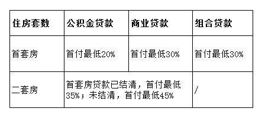

# 2018年长沙限购令细则及限购区域

长沙市在2017年3月份实施了新的住房限购政策，到5月20日的时候长沙房地产的调控进一步升级，所以现在长沙的购房限购政策可以让很多人非常的烦恼。到底在长沙买房具体是怎样的呢，而在长沙买房，首付又需要多少呢？让我们一起来看看这篇文章吧。

## 长沙限购区域

芙蓉区、天心区、岳麓区、开福区、雨花区、望城区、长沙县。

## 长沙限购政策

1、本市户籍本市家庭限购2套。

注：

①2017年9月23日后办理的本市个人家庭户和集体户个人，在限购区域无房，限购1套商品住房。

②本市户籍家庭在本市已有一套住房的，待首套住房取得不动产权证满3年后，方可购买第二套住房。

关于户籍的认定：

①户籍，以公安部门的户籍证明（含集体户口）为准，不以身份证号为准。

②户籍家庭，家庭成员（配偶及未成年子女，下同）中有长沙市户籍的，属于本市户籍家庭；家庭成员中无长沙市户籍的，属于本市外户籍家庭。

③个人家庭，指居民户口簿上户主与常住人口为同一人。

2、非本市户籍

在本市无住房的非本市户籍家庭，凭在长沙市连续缴纳24个月以上个人所得税或社会保险证明限购1套商品住房。

3、其它

①属于省、市、区引进人才和公务工作调动的非本市户籍家庭凭有关部门证明限购1套商品住房。

②长沙市认定的A、B、C、D类人才，享受长沙户籍人口购房政策。

③在长工作、具有专科及以上学历或技师及以上职业资格的人才，首套购房不受户籍和个税、社保缴存限制。

## 买房首付

1、住房属性

以长沙市商品房销售网上签约系统和长沙市不动产登记系统认定的房屋性质为准。

2、住房套数

是指本人及家庭成员在限购区域内已合同网签和已办理房屋所有权证、不动产证的住房套数；已注销的住房和非住宅，不计入住房套数。

3、关于被征收人的购房套数问题

在限购区域内，被征收人原房屋被征收，可以在签订征收协议后一年内，凭长沙市征收办已备案的拆迁协议向长沙市房屋交易管理中心申请按被征收套数购买商品住房。

4、关于限购商品住房套数的认定

2017年9月23以后（含9月23日）办理的本市个人家庭和集体户个人，且在限购区域内无住房的，限购1套商品住房。本市户籍家庭，待首套住房取得不动产权属证书满3年后，方可购买第2套商品住房。

5、特殊房产交易限制

因法院判决、继承取得不动产（房屋）权属的，不受限购政策限制，也不受满三年上市交易限制；经济适用房及棚改货补房上市、遗失补证、变更、更正、离异及夫妻约定取得不动产（房屋）权属证书的，按换证前不动产（房屋）权属证书登记时间起算，满三年方可上市交易。

6、赠与、拍卖（不含法院拍卖）按限购政策执行。